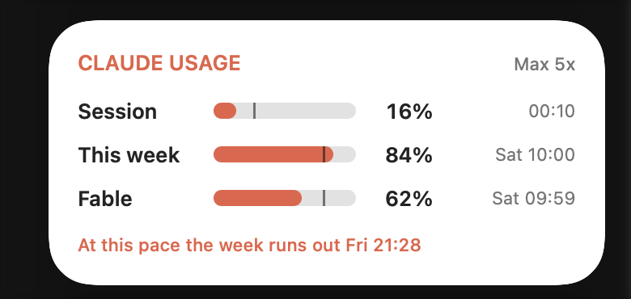

# Claude Usage — a macOS desktop widget

Your Claude plan limits on the desktop, next to the clock and calendar: the
**5-hour session**, **this week** (all models), and **model-scoped weekly caps
like Fable**, each with its reset time. The same numbers as
[claude.ai → Settings → Usage](https://claude.ai/settings/usage), without opening it.



- **Small and medium** widget sizes, in light and dark mode
- A **pace marker** on each bar shows where an even burn rate would be right now
- The medium widget tells you whether the week is **on track** or when it **runs out at this pace**
- A tiny menu-bar item (optional) with the same numbers and a Refresh button

## Requirements

- macOS 14 Sonoma or later
- **Claude Code**, installed and signed in with your Claude Pro/Max account (`claude`, then `/login`).
  The widget reuses that login; it doesn't ask for your password.

## Install

**Prebuilt (no Xcode needed):**

```sh
curl -fsSL https://github.com/nixmaldonado/claude-usage-widget/releases/latest/download/install.sh | bash
```

That runs the `install.sh` attached to the [latest release](https://github.com/nixmaldonado/claude-usage-widget/releases/latest).
It downloads `ClaudeUsage.zip` from the same release and refuses to install it unless
its SHA-256 matches the one baked into the script. Both are built by
[GitHub Actions](.github/workflows/build.yml) from this repo, with a
[build provenance attestation](#verifying-a-download). Prefer to read it first?
Download both files from the release page and run `bash install.sh ~/Downloads/ClaudeUsage.zip`.

**From source** (needs Xcode 15+, free on the Mac App Store):

```sh
git clone https://github.com/nixmaldonado/claude-usage-widget.git
cd claude-usage-widget
./build.sh
```

Either way the script copies the app to `/Applications`, checks that it can read
your usage, and launches it. Then:

**Right-click the desktop → Edit Widgets… → search "Claude Usage"** and drag it out.

The app runs in the background, starts at login, and refreshes every 5 minutes.
Clicking the widget refreshes right away.

## How it works

```
Claude Code login (Keychain)          api.anthropic.com/api/oauth/usage
            │  read-only                         ▲
            ▼                                    │ every 5 min
   ClaudeUsage.app  (menu-bar agent) ────────────┘
            │  writes
            ▼
   ~/Library/Application Support/ClaudeUsageWidget/usage.json
            │  reads (sandboxed, read-only exception for this folder)
            ▼
   Claude Usage widget
```

- The app reads the OAuth token Claude Code keeps in your login Keychain
  (item `Claude Code-credentials`) with `/usr/bin/security`. It **never refreshes or
  rewrites** that token, so it can't log Claude Code out.
- It calls `GET https://api.anthropic.com/api/oauth/usage`, the endpoint behind
  Claude Code's `/usage`. That's the only network request it makes.
- The result goes to a small JSON file that the widget extension reads. WidgetKit
  requires widgets to be sandboxed, so the extension has a read-only exception for
  that one folder and no network access.

## Security and privacy

- **Your login stays put.** The token is read with `find-generic-password` and held in
  memory only for the request. It is never logged, printed, written to disk, passed on a
  command line, or sent anywhere except `api.anthropic.com` over HTTPS (redirects are
  refused, so it can't be forwarded to another host).
- **Nothing else leaves your Mac.** No analytics, no other servers. The snapshot file
  holds percentages and reset times only.
- **The widget can't do much.** It's sandboxed with no network access and read-only
  access to one folder.
- **The app is hardened.** Hardened runtime is on and debugging entitlements are off, so
  other processes can't attach to it or inject code.
- **Clicking `claudeusage://refresh` links is harmless.** Any app or web page can open
  that URL, but it only triggers a refresh, at most once every 30 seconds.
- **It identifies itself honestly.** Requests carry a `ClaudeUsageWidget/<version>`
  User-Agent rather than pretending to be Claude Code.

### Verifying a download

Every release zip has a SHA-256 file and a signed
[build provenance attestation](https://docs.github.com/en/actions/security-for-github-actions/using-artifact-attestations)
showing which workflow run in this repo built it:

```sh
shasum -a 256 ClaudeUsage.zip          # compare with ClaudeUsage.zip.sha256
gh attestation verify ClaudeUsage.zip -R nixmaldonado/claude-usage-widget
```

## Caveats

- **This is unofficial.** It uses your Claude Code login against an endpoint Anthropic
  hasn't documented for third-party use. Read-only polling every few minutes is light,
  but Anthropic could change the endpoint or restrict this kind of access, and you're
  using it at your own discretion.
- **The response format can change.** The
  parser is lenient (it understands both the `limits[]` array and the older
  `five_hour` / `seven_day` fields), but expect the occasional fix.
- **Your Claude Code login has to be current.** If you haven't used Claude Code for a
  while, its token may expire and the widget shows *"run `claude` to sign in"*. Run
  `claude` once, then click the widget.
- **Signed ad-hoc, not notarized.** Notarization needs a paid Apple Developer ID, so
  `install.sh` clears the download's quarantine flag for you. Opening the zip by
  double-click instead will get it blocked by Gatekeeper.

## Troubleshooting

```sh
# Fetch once and print what the widget will show
/Applications/ClaudeUsage.app/Contents/MacOS/ClaudeUsage --once

# Print the raw API response (no secrets in it — just percentages and dates)
/Applications/ClaudeUsage.app/Contents/MacOS/ClaudeUsage --raw

# Live logs
log stream --predicate 'subsystem == "com.nixmaldonado.ClaudeUsage"'
```

- **Widget missing from the gallery:** make sure the app is in `/Applications` and has
  been opened once, then run `killall chronod NotificationCenter` and look again.
- **Widget shows old numbers:** WidgetKit throttles reloads. Click the widget to force a
  refresh.
- **Menu-bar icon hidden:** open Claude Usage again from Spotlight to bring it back.

## Uninstall

```sh
./uninstall.sh
```

## Development

The Xcode project is generated from `project.yml` with
[XcodeGen](https://github.com/yonaskolb/XcodeGen) (`brew install xcodegen`). Edit
`project.yml`, then run `xcodegen generate` or `./build.sh`.

```
App/      menu-bar agent: Keychain login, API fetch, parser, login item
Widget/   WidgetKit extension: timeline + small/medium views
Shared/   snapshot model and file location used by both
```

## Credits

Endpoint details were worked out by the community; see
[ClaudeBar](https://github.com/GordonBeeming/claude-bar) and
[ai-usagebar](https://docs.rs/crate/ai-usagebar/latest) for menu-bar takes on the same idea.

Not affiliated with Anthropic.

## License

[MIT](LICENSE)
